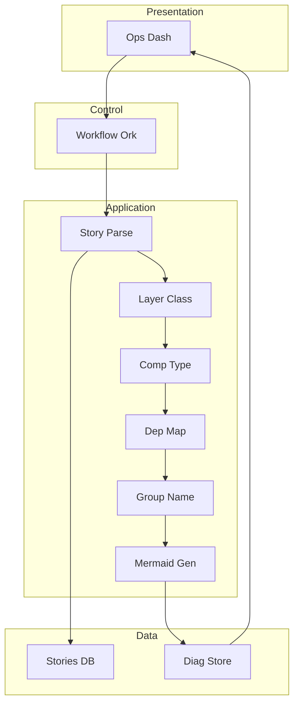
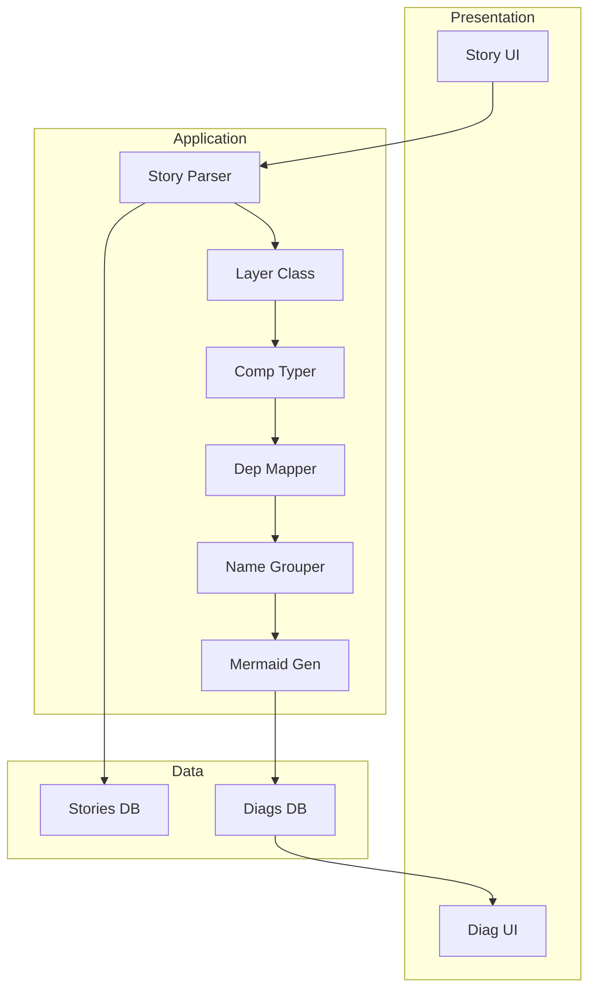
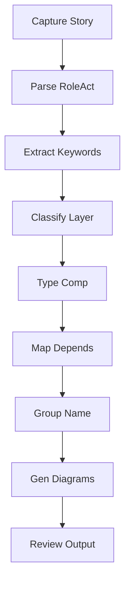
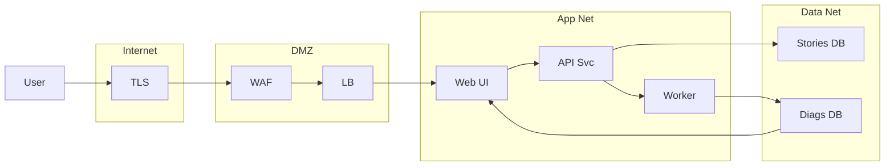
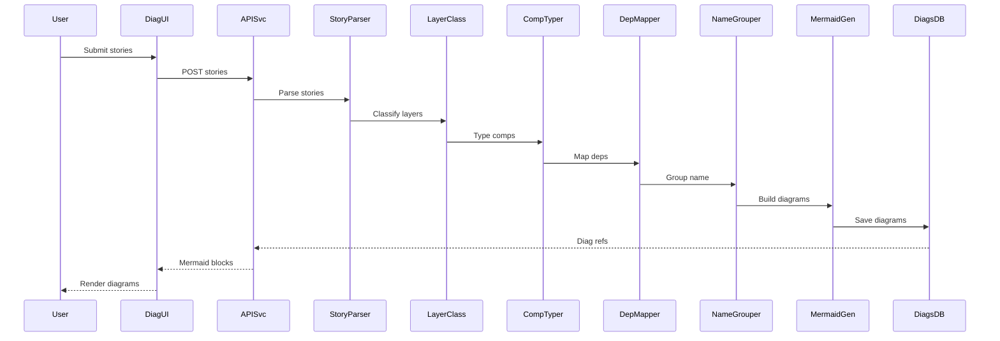

```mermaid
%% TITLE: System Architecture
graph TD
  subgraph L1["Presentation"]
    p1["Ops Dash"]
  end

  subgraph L2["Control"]
    c1["Workflow Ork"]
  end

  subgraph L3["Application"]
    a1["Story Parse"]
    a2["Layer Class"]
    a3["Comp Type"]
    a4["Dep Map"]
    a5["Group Name"]
    a6["Mermaid Gen"]
  end

  subgraph L4["Data"]
    d1["Stories DB"]
    d2["Diag Store"]
  end

  p1 --> c1
  c1 --> a1
  a1 --> a2
  a2 --> a3
  a3 --> a4
  a4 --> a5
  a5 --> a6
  a1 --> d1
  a6 --> d2
  d2 --> p1
```

```mermaid
%% TITLE: Component Diagram
graph TD
  subgraph T1["Presentation"]
    ui1["Diag UI"]
    ui2["Story UI"]
  end

  subgraph T2["Application"]
    app1["Story Parser"]
    app2["Layer Class"]
    app3["Comp Typer"]
    app4["Dep Mapper"]
    app5["Name Grouper"]
    app6["Mermaid Gen"]
  end

  subgraph T3["Data"]
    db1["Stories DB"]
    db2["Diags DB"]
  end

  ui2 --> app1
  app1 --> app2
  app2 --> app3
  app3 --> app4
  app4 --> app5
  app5 --> app6
  app1 --> db1
  app6 --> db2
  db2 --> ui1
```

```mermaid
%% TITLE: Business Architecture
graph TD
  b1["Capture Story"]
  b2["Parse RoleAct"]
  b3["Extract Keywords"]
  b4["Classify Layer"]
  b5["Type Comp"]
  b6["Map Depends"]
  b7["Group Name"]
  b8["Gen Diagrams"]
  b9["Review Output"]

  b1 --> b2
  b2 --> b3
  b3 --> b4
  b4 --> b5
  b5 --> b6
  b6 --> b7
  b7 --> b8
  b8 --> b9
```

```mermaid
%% TITLE: Network Architecture
graph LR
  n1["User"]
  subgraph n2["Internet"]
    net1["TLS"]
  end
  subgraph n3["DMZ"]
    dmz1["WAF"]
    dmz2["LB"]
  end
  subgraph n4["App Net"]
    app1["Web UI"]
    app2["API Svc"]
    app3["Worker"]
  end
  subgraph n5["Data Net"]
    data1["Stories DB"]
    data2["Diags DB"]
  end

  n1 --> net1 --> dmz1 --> dmz2 --> app1
  app1 --> app2
  app2 --> app3
  app2 --> data1
  app3 --> data2
  data2 --> app1
```

```mermaid
%% TITLE: Sequence Diagram
sequenceDiagram
  participant U as User
  participant UI as DiagUI
  participant API as APISvc
  participant P as StoryParser
  participant L as LayerClass
  participant T as CompTyper
  participant D as DepMapper
  participant N as NameGrouper
  participant G as MermaidGen
  participant S as DiagsDB

  U->>UI: Submit stories
  UI->>API: POST stories
  API->>P: Parse stories
  P->>L: Classify layers
  L->>T: Type comps
  T->>D: Map deps
  D->>N: Group name
  N->>G: Build diagrams
  G->>S: Save diagrams
  S-->>API: Diag refs
  API-->>UI: Mermaid blocks
  UI-->>U: Render diagrams
```