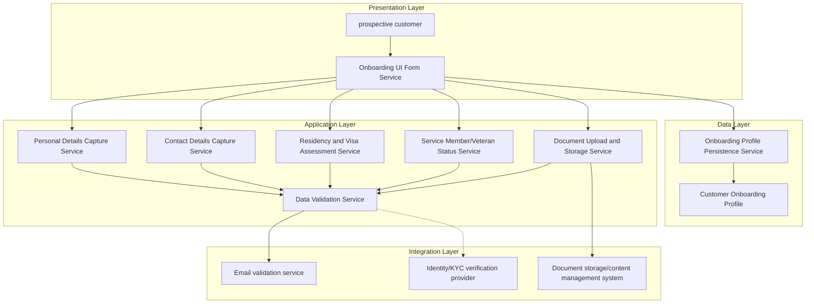
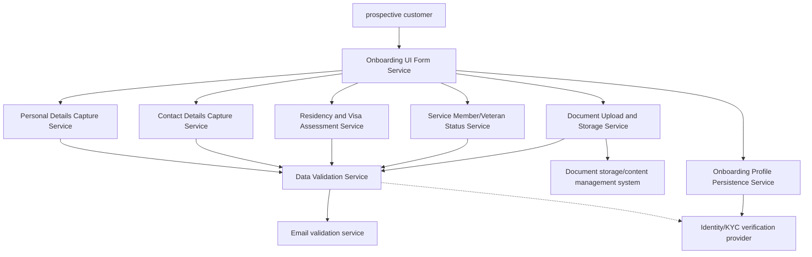
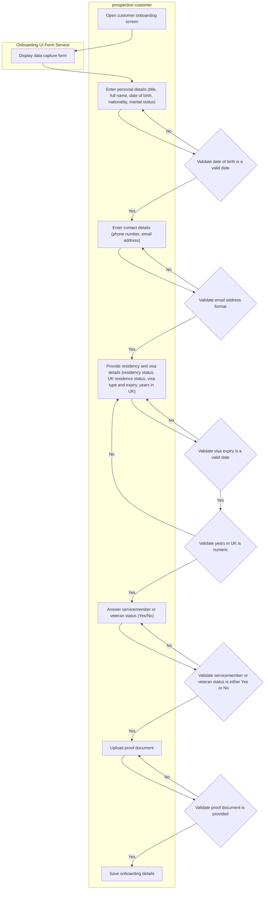
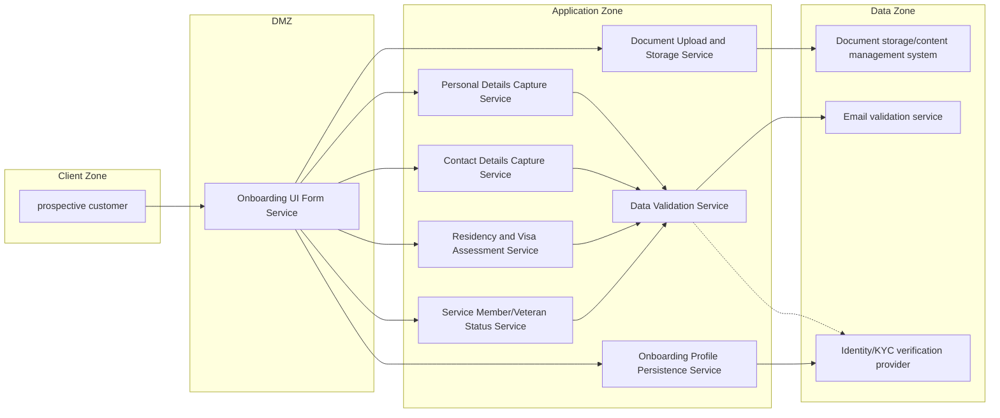
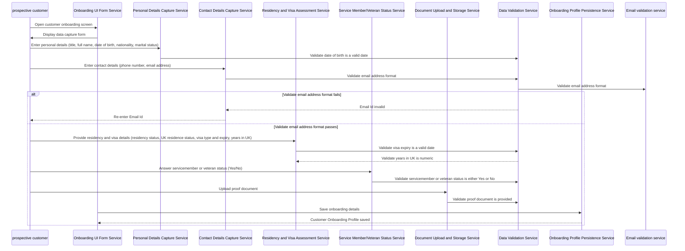

```mermaid
%% TITLE: System Architecture
graph TD
  subgraph Presentation_Layer["Presentation Layer"]
    actor_pc["prospective customer"]
    svc_ui["Onboarding UI Form Service"]
  end

  subgraph Application_Layer["Application Layer"]
    svc_personal["Personal Details Capture Service"]
    svc_contact["Contact Details Capture Service"]
    svc_residency["Residency and Visa Assessment Service"]
    svc_service_status["Service Member/Veteran Status Service"]
    svc_doc["Document Upload and Storage Service"]
    svc_validation["Data Validation Service"]
  end

  subgraph Integration_Layer["Integration Layer"]
    ext_email["Email validation service"]
    ext_docstore["Document storage/content management system"]
    ext_kyc["Identity/KYC verification provider"]
  end

  subgraph Data_Layer["Data Layer"]
    svc_persist["Onboarding Profile Persistence Service"]
    ent_profile["Customer Onboarding Profile"]
  end

  actor_pc --> svc_ui
  svc_ui --> svc_personal
  svc_ui --> svc_contact
  svc_ui --> svc_residency
  svc_ui --> svc_service_status
  svc_ui --> svc_doc
  svc_personal --> svc_validation
  svc_contact --> svc_validation
  svc_residency --> svc_validation
  svc_service_status --> svc_validation
  svc_doc --> svc_validation
  svc_validation --> ext_email
  svc_doc --> ext_docstore
  svc_validation -.-> ext_kyc
  svc_ui --> svc_persist
  svc_persist --> ent_profile
```

```mermaid
%% TITLE: Component Diagram
graph TD
  actor_pc["prospective customer"]
  svc_ui["Onboarding UI Form Service"]
  svc_personal["Personal Details Capture Service"]
  svc_contact["Contact Details Capture Service"]
  svc_residency["Residency and Visa Assessment Service"]
  svc_service_status["Service Member/Veteran Status Service"]
  svc_doc["Document Upload and Storage Service"]
  svc_validation["Data Validation Service"]
  svc_persist["Onboarding Profile Persistence Service"]
  ext_email["Email validation service"]
  ext_docstore["Document storage/content management system"]
  ext_kyc["Identity/KYC verification provider"]

  actor_pc --> svc_ui

  svc_ui --> svc_personal
  svc_ui --> svc_contact
  svc_ui --> svc_residency
  svc_ui --> svc_service_status
  svc_ui --> svc_doc
  svc_ui --> svc_persist

  svc_personal --> svc_validation
  svc_contact --> svc_validation
  svc_residency --> svc_validation
  svc_service_status --> svc_validation
  svc_doc --> svc_validation

  svc_validation --> ext_email
  svc_validation -.-> ext_kyc
  svc_doc --> ext_docstore
  svc_persist --> ext_kyc
```

```mermaid
%% TITLE: Business Process Flow
graph TD
  subgraph prospective_customer["prospective customer"]
    step_open["Open customer onboarding screen"]
    step_enter_personal["Enter personal details (title, full name, date of birth, nationality, marital status)"]
    step_enter_contact["Enter contact details (phone number, email address)"]
    step_residency["Provide residency and visa details (residency status, UK residence status, visa type and expiry, years in UK)"]
    step_service["Answer servicemember or veteran status (Yes/No)"]
    step_upload["Upload proof document"]
    step_save["Save onboarding details"]
  end

  subgraph Onboarding_UI_Form_Service["Onboarding UI Form Service"]
    step_display["Display data capture form"]
  end

  val_dob{"Validate date of birth is a valid date"}
  val_email{"Validate email address format"}
  val_visa_expiry{"Validate visa expiry is a valid date"}
  val_years_numeric{"Validate years in UK is numeric"}
  val_service_yesno{"Validate servicemember or veteran status is either Yes or No"}
  val_doc{"Validate proof document is provided"}

  step_open --> step_display --> step_enter_personal --> val_dob
  val_dob -- Yes --> step_enter_contact --> val_email
  val_dob -- No --> step_enter_personal

  val_email -- Yes --> step_residency --> val_visa_expiry
  val_email -- No --> step_enter_contact

  val_visa_expiry -- Yes --> val_years_numeric
  val_visa_expiry -- No --> step_residency

  val_years_numeric -- Yes --> step_service --> val_service_yesno
  val_years_numeric -- No --> step_residency

  val_service_yesno -- Yes --> step_upload --> val_doc
  val_service_yesno -- No --> step_service

  val_doc -- Yes --> step_save
  val_doc -- No --> step_upload
```

```mermaid
%% TITLE: Network & Deployment Architecture
graph LR
  subgraph Client_Zone["Client Zone"]
    actor_pc["prospective customer"]
  end

  subgraph DMZ["DMZ"]
    svc_ui["Onboarding UI Form Service"]
  end

  subgraph Application_Zone["Application Zone"]
    svc_personal["Personal Details Capture Service"]
    svc_contact["Contact Details Capture Service"]
    svc_residency["Residency and Visa Assessment Service"]
    svc_service_status["Service Member/Veteran Status Service"]
    svc_doc["Document Upload and Storage Service"]
    svc_validation["Data Validation Service"]
    svc_persist["Onboarding Profile Persistence Service"]
  end

  subgraph Data_Zone["Data Zone"]
    ext_docstore["Document storage/content management system"]
    ext_email["Email validation service"]
    ext_kyc["Identity/KYC verification provider"]
  end

  actor_pc --> svc_ui
  svc_ui --> svc_personal
  svc_ui --> svc_contact
  svc_ui --> svc_residency
  svc_ui --> svc_service_status
  svc_ui --> svc_doc
  svc_ui --> svc_persist
  svc_personal --> svc_validation
  svc_contact --> svc_validation
  svc_residency --> svc_validation
  svc_service_status --> svc_validation
  svc_doc --> ext_docstore
  svc_validation --> ext_email
  svc_validation -.-> ext_kyc
  svc_persist --> ext_kyc
```

```mermaid
%% TITLE: Sequence Diagram
sequenceDiagram
  participant prospective_customer as prospective customer
  participant Onboarding_UI_Form_Service as Onboarding UI Form Service
  participant Personal_Details_Capture_Service as Personal Details Capture Service
  participant Contact_Details_Capture_Service as Contact Details Capture Service
  participant Residency_and_Visa_Assessment_Service as Residency and Visa Assessment Service
  participant Service_Member_Veteran_Status_Service as Service Member/Veteran Status Service
  participant Document_Upload_and_Storage_Service as Document Upload and Storage Service
  participant Data_Validation_Service as Data Validation Service
  participant Onboarding_Profile_Persistence_Service as Onboarding Profile Persistence Service
  participant Email_validation_service as Email validation service

  prospective_customer->>Onboarding_UI_Form_Service: Open customer onboarding screen
  Onboarding_UI_Form_Service->>prospective_customer: Display data capture form
  prospective_customer->>Personal_Details_Capture_Service: Enter personal details (title, full name, date of birth, nationality, marital status)
  Personal_Details_Capture_Service->>Data_Validation_Service: Validate date of birth is a valid date
  prospective_customer->>Contact_Details_Capture_Service: Enter contact details (phone number, email address)
  Contact_Details_Capture_Service->>Data_Validation_Service: Validate email address format
  Data_Validation_Service->>Email_validation_service: Validate email address format
  alt Validate email address format fails
    Data_Validation_Service-->>Contact_Details_Capture_Service: Email Id invalid
    Contact_Details_Capture_Service-->>prospective_customer: Re-enter Email Id
  else Validate email address format passes
    prospective_customer->>Residency_and_Visa_Assessment_Service: Provide residency and visa details (residency status, UK residence status, visa type and expiry, years in UK)
    Residency_and_Visa_Assessment_Service->>Data_Validation_Service: Validate visa expiry is a valid date
    Data_Validation_Service-->>Residency_and_Visa_Assessment_Service: Validate years in UK is numeric
    prospective_customer->>Service_Member_Veteran_Status_Service: Answer servicemember or veteran status (Yes/No)
    Service_Member_Veteran_Status_Service->>Data_Validation_Service: Validate servicemember or veteran status is either Yes or No
    prospective_customer->>Document_Upload_and_Storage_Service: Upload proof document
    Document_Upload_and_Storage_Service->>Data_Validation_Service: Validate proof document is provided
    Onboarding_UI_Form_Service->>Onboarding_Profile_Persistence_Service: Save onboarding details
    Onboarding_Profile_Persistence_Service-->>Onboarding_UI_Form_Service: Customer Onboarding Profile saved
  end
```